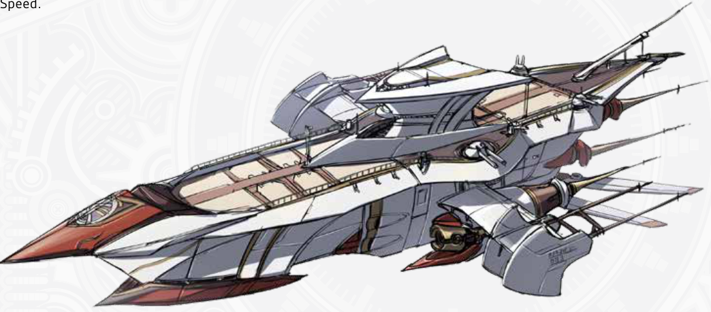
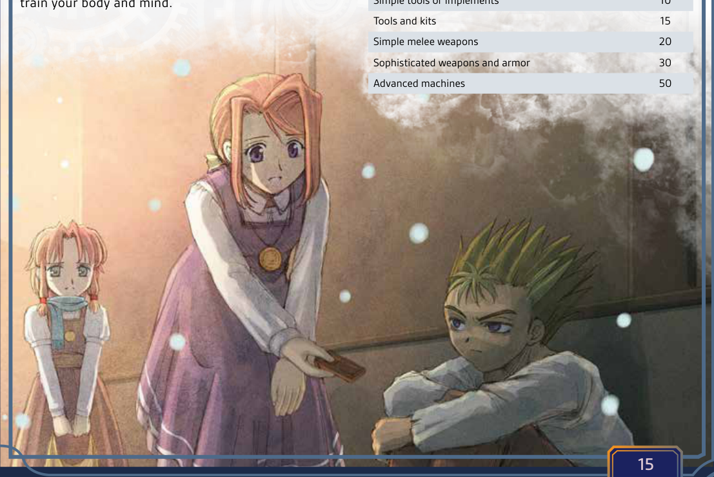
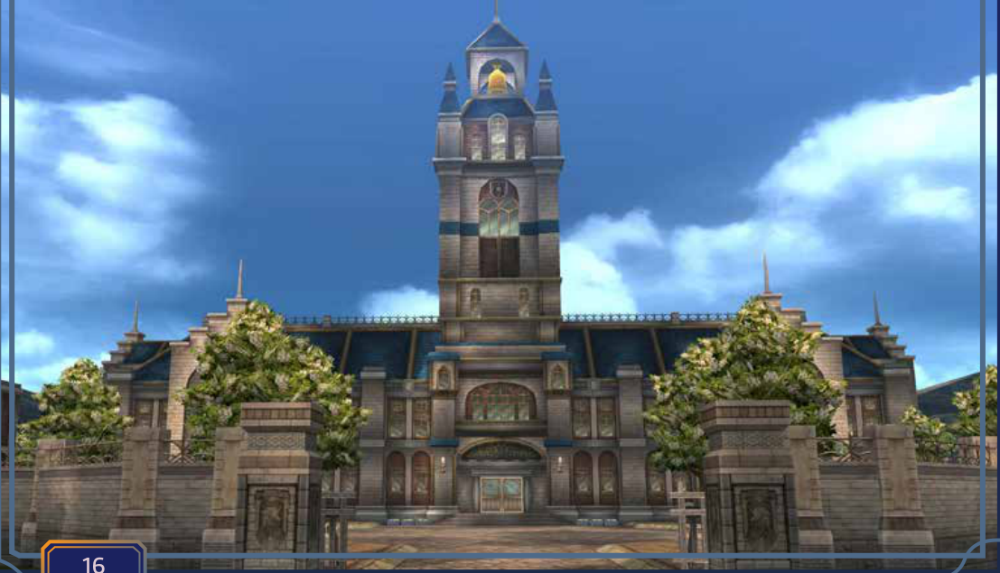

# 第二章 — 冒险

火把的光芒在潮湿的洞窟墙壁上摇曳。

随着四名冒险者小心翼翼地踏过湿滑的岩石，阴影随之舞动。古老的导力机械发出的微弱嗡鸣从深处传来，在脚下轻柔地震动。马库斯手持出鞘的利刃在前带路，探查着陷阱；艾蕾娜的手指悬停在她那镶嵌着耀晶石的法杖上方，准备随时低语召唤元素防护。罗温检视着铭文，眉头紧锁，解读着可能开启这座遗迹秘密的古塞姆利亚文字。与此同时，始终保持警惕的莱拉停下脚步，竖起耳朵聆听回荡在黑暗中的动静。前方，一扇华丽的大门隐约浮现，上面蚀刻着早已被遗忘的符号。当他们靠近时，嗡鸣声愈发强烈，在骨骼中共鸣，让他们心中充满了恐惧与兴奋。大门缓缓吱呀打开，露出一间沐浴在淡蓝色微光中的墓室，被某个正在苏醒的古老存在守护着。他们的心跳如擂鼓，明白真正的冒险才刚刚开始。

《命运之轨迹》的核心在于激动人心的探索、发现，以及英雄们必须克服的英勇挑战。冒险通过你们的选择、勇气与急智展开，让你的队伍沉浸在一个鲜活的、每一个决定都举足轻重的叙事之中。作为冒险者，你们将深入古代遗迹，直面隐藏的危险，揭开可能影响世界命运的谜团。

## 时间 Time

在游戏过程中，你可能会发现，数分钟的角色扮演在角色眼中不过是寥寥数秒。因此，像回合和轮这样的抽象时间单位，是为了游戏的连贯性而存在的。

有时，一个事件需要十分钟还是十秒根本无关紧要；而在其他情况下，每一秒都至关重要。在战斗中，每一个回合和轮都很重要。尽管它们只持续短短数秒，但许多效果和状况仍仅在你的回合内或一个完整的轮后才适用。有时你想做的事情可能需要多个动作或回合才能完成，例如装填武器或吟唱咒语。

### 台面上(Uptime)与休整期(Downtime)

当玩家行动并描述自己的行为、对事件作出反应，以及普遍以角色身份游玩时，他们就处于台面上。在此类情形中，衡量游戏内时间可能非常重要，例如一名角色试图维持一个警卫的注意力五分钟，好让同伴破坏安全系统，又或者另一名已中毒的角色仅剩数秒寻找解药。

相反，休整期则描述那些以极简细节带过的事件，GM 在此“快进”了。花费数周的训练、一位大师铁匠花费数月打造一柄完美的剑，或一名程序员花费漫漫长夜编写一个强大的程序，都是休整期的绝佳例子。

## 移动与旅行 Movement and Travel

无论你是在爆炸的走廊中全速奔跑，还是飞跃一道深不见底的裂谷，你在环境中移动的方式都意味着生与死的差别。此外，许多生物拥有特殊的移动方式。特殊移动方式，例如天生的游泳者或拥有翅膀能够飞行，通常会基于你的速度值，就像你的陆地移动一样。

### 移动速度 Movement Speed

你可以消耗一个动作移动20尺，并且你的每颗**速度**(Speed)加值骰能使移动距离增加5尺。此移动速度会受到多种效果影响。

### 陆地冲刺 Overland Sprinting

所有生物都能在短时间内跑得更快。

一次普通**冲刺**(Sprint)能将你基于**速度**的移动距离增加1/2，持续1分钟，并在结束时消耗10点耐力。运动天赋“冲刺”可以让你更快，并且允许你在战斗中冲刺。

### 困难地形 Challenging Terrain

当被迫穿越障碍物时，无论是茂密的灌木丛还是泥泞的沼泽，你的移动距离都会减少1/2。这同样适用于陆地旅行和战斗中的移动。

### 缓慢移动 Slow Pace

当你气喘吁吁(winded)或是在移动中同时进行其他活动（例如潜行）时，你只能缓慢移动：减半你基于速度的普通移动距离。

!!! note "译注"
    原文为 you can only move at a slow pace, 1/2 your normal movement based on Speed.

### 跳远和跳高 Leaping and Jumping

从站立姿势起跳，你每拥有10点力量就可以垂直跳起1尺高。若通过VS 20的运动检定，你每拥有10点力量就可以垂直跳起2尺高。

一个中型生物可以水平跳远5尺，每有一颗力量加值骰就能额外增加5尺。如果有至少20尺的助跑距离并通过VS 20的运动检定，你可以将你的速度加值骰和力量加值骰相加，来决定你的最大跳远距离。

### 游泳与攀爬 Swimming and Climbing

对大多数生物来说，游泳和攀爬被视为困难地形。在某些情况下，进行此类移动时，生物可能需要通过相应的技能检定，否则可能会坠落或溺水。

### 移动与体型 Movement and Size

你的整体移动速度会受你的体型影响。在陆地上，小型生物比大型生物稍慢，而生物的跳跃距离则极大程度上受其体型类别的影响。

| 生物体型      | 陆地速度 | 跳远和跳高 |
| ------------- | -------- | ---------- |
| 微型 Tiny     | 1/2      | 1/4        |
| 小型 Small    | —        | 1/2        |
| 中型 Medium   | —        | —          |
| 大型 Large    | —        | —          |
| 巨型 Huge     | X2       | X2         |
| 超巨 Massive  | X3       | X4         |
| 庞大 Colossal | X5       | X8         |

### 陆地旅行 Overland Travel

你步行、骑乘坐骑（或凭借翅膀飞行）进行陆地旅行的距离取决于你的**速度**属性值或坐骑的速度属性值。每小时你可以行进2英里，并且你的每颗速度加值骰能使距离增加1英里。一同旅行的队伍使用队伍成员中最慢的速度值。乘坐载具旅行时，你应使用该载具的巡航速度（英里/小时）。

长时间的陆地旅行应被视为休整期(Downtime)。在旅行途中，你完全可以搜寻食物和水、调查周边区域、绘制或标记你的路线，甚至进行一些轻度训练。

在长途旅行中，你的GM也可能安排随机遭遇，例如遇到怪物、强盗或需要帮助的旁观者。这些情况可能会耽搁你的行程或将你置于危险之中，也可能为你提供获取某种奖励的机会。

### 移动减益 Movement Penalties

你有可能受到多种移动减益，例如在困难地形中潜行，或在暴风雨中穿越复杂地形。但在大多数情况下，这些减益并不叠加；你只取用最严重的那项减益。

## 环境 The Environment

### 坠落与撞击 Falling and Impacts

从危险高度坠落，或被巨大沉重的物体砸中，都会造成严重伤害。坠落结束时，生物每坠落10英尺，便会根据其体型承受一颗骰子的钝击伤害。除非该生物避免了坠落伤害，否则它会以倒地状态着地。当物体坠落到生物（或另一物体）上时，双方都会承受此伤害。

| 体型   | 坠落伤害 |
| ------ | -------- |
| 微型   | D4       |
| 小型   | D6       |
| 中型   | D8       |
| 大型   | D10      |
| 巨型   | D12      |
| 超巨型 | D20      |
| 庞然   | D100     |

### 天气与温度 Weather and Temperature

**恶劣天气**：
当你试图在风暴、暴风雪或沙尘暴中进行陆地旅行时，除非另有说明，否则你的陆路行进距离减半。风暴还会严重降低能见度，并造成危险状况，例如难以察觉的悬崖或复杂地形。

**温度**：
极端温度会削弱你的力量，甚至夺走你的生命。通常来说，冒险时需要考虑五种温度类别。

- **严寒**：零下10°F/零下23°C以下的极寒被视为严寒。大多数生物在这种气候下每天需要两倍的食物。除了下述失温症的影响外，在没有适当防护的情况下，每分钟将直接对生命值造成1d4点寒冷伤害。

- **寒冷**：约0°F/零下18°C的冬日寒冷，可能会使没有足够防护的人患上失温症。在没有防护的情况下，每小时你必须进行一次抵抗（体魄或意志）检定 VS 20，失败则会失温。一旦你失温，你就会陷入眩晕，并且每小时失去1d8点耐力，直到你的体温恢复温暖。当你的耐力降至0时，你开始失去生命值。

- **温和**：这是一个从32°F/0°C到85°F/30°C的宽泛范围。对于大多数生物而言，在此温度范围内没有修正。

- **炎热**：高于90°F/32°C即被视为炎热。当你在炎热环境中消耗耐力时，你会消耗两倍的耐力，并且极易陷入气喘吁吁状态。如果你陷入气喘吁吁，在炎热持续时，你会承受1级疲劳。

- **酷热**：在约110°F/43°C时，温度达到酷热且极度危险。大多数生物需要两倍的水分来维持水分。除了耐力消耗增加外，每次你使用耐力时，都必须进行一次抵抗（物理、体魄或意志）检定 VS 25，否则将中暑，并承受1级疲劳。

### 光照条件 Lighting Conditions

光照能影响角色试图做的一切事情，从修理机械到远距离射击，但仅限在非常暗或非常非常亮的情况下。

**黑暗**：
低光照和黑暗会对你的表现产生显著影响。

- **完全黑暗**：在完全黑暗或目盲状态下，角色无法正常视物，必须依赖其他感官。诸如书写或制作等手工技能，或任何深度依赖灵巧及视觉/空间感的活动，如驾驶，其VS会增加+15。
- **部分黑暗**：这是指5英尺内没有任何比蜡烛更亮的光源时的黑暗。角色在所有手工专长(manual specialty)的VS上承受+10的罚值。
- **微光**：如仅有一根蜡烛或部分光照，处于微光环境中的角色在VS上承受+5的罚值。

**强光**：
在持续极度明亮且刺眼的光照下，角色的视觉会受损。在暴露于刺眼光照期间及之后的1d10轮内，所有需要视力的VS检定都承受+10的罚值。暴露于致盲闪光或眩光下会导致致盲状态，持续1d10轮，除非你能通过一次抵抗检定VS 25。

### 维生 Sustenance

被迫在没有足够食物和水的情况下忍受的生物最终会因饥饿和脱水而倒下。一名处于饥饿或脱水状态的角色在摄入足量食物和水分并完成一次休息之前，无法恢复耐力或耐久。

**食物**：
在常规运动和体力消耗水平下，一个中型生物每天需要1磅食物。一名角色在保持活动且消耗能量的情况下，可以依靠每10点体魄坚持1天不进食。通过每天至少花一半时间休息或只吃一半口粮，角色能坚持更久。每消耗半份口粮的一天算作半天未进食，而完全休息的每一天只需一半食物。在超出该期限后的第一个完整日结束，以及之后的每个完整日结束时，饥饿的角色会获得1级疲劳。他们可以尝试通过正常休息来克服该疲劳。

**水**：
一名角色每天需要1升水才能生存；如果活动量很大，或平均温度处于炎热或酷热水平，则需要每天2升。角色每有15点体魄便可坚持1天，之后才会出现严重脱水。超过此期限后，每缺少足够饮水一天，角色便会获得1级疲劳。

**空气与窒息**：
几乎所有的角色都需要呼吸，在水下或真空中可能会因缺少空气而窒息。大多数生物可以屏住呼吸1分钟，并且每拥有一颗体魄加值骰可额外增加1分钟。超出此时间后，每分钟消耗30耐力。一旦耐力耗尽且没有空气，生物便会失去意识并陷入休克。若该生物在等同于其体魄值的回合数内未能获救，便会死亡。及时获救的生物可以通过一次VS 20的医药检定来复苏。

**休息与恢复**：
即便是最强大的存在也需要休整，耐久、生命值、耐力和魔力都需要时间恢复。

- **短休**(Break)：这是一段至少2小时的休息时段。进行休息时，你可以从事轻度活动，例如步行、烹饪、维护装备、阅读、冥想或静养。一次休息将恢复你全部的耐力，以及每点体魄对应1点耐久。如果你拥有体魄加值，每天可以投掷一次该加值骰，并在一次休息中恢复等量的耐久。除非你拥有冥想，休息期间你将恢复5点魔力。如果没有得到医疗，一次休息只能恢复2点生命值。
- **睡眠**(Sleep)：至少八小时的良好夜间休息将恢复你全部的耐力与耐久，以及10点生命值。如果你拥有体魄属性加值骰，可以投掷这些骰子并额外恢复等量生命值。睡眠期间，你恢复20点魔力。如果你拥有灵魂属性的任何加值骰，可以投掷这些骰子并在睡眠时恢复等量魔力。即使生物一连睡上数天，每天也只能获得一次这些好处。按照这种恢复速度，极强大的生物在一场恶战之后常常必须休息数周或数月才能完全恢复。

## 行动之后 After the Action

你不会每时每刻都在对抗邪恶、制造麻烦和搜寻战利品。冒险之间会有安静的休整时刻，你可能想在那时从事其他活动。这些短暂的时刻，GM可能会进行一些详细描述，讲述发生的关键事件和互动，也可能只是作为冒险的序章或终章被简要概括。

### 生活开销 Cost of Living

食物、饮品和住宿都需要花费。除非你拥有房产或住在交通工具上，否则冒险之间你需要为落脚之处付费。这就是你的生活开销。在任何较长时间的休整期内，你都需要花费足够的金钱，以维持你所选择生活方式的开销。

### 利用休整期 Using Downtime

有几种方法可以用来安排冒险之间的时间。如果你受了伤，可能会花时间休养。但除此之外，你可能想进行一些实用研究、从事一份普通工作、锻炼某项技能，或是训练你的身体与心智。

**从事一门手艺** Practice a Trade

无论是作为艺术家还是工程师，冒险者拥有制造各种东西的技能——无论是实用物品、神秘造物还是科学作品，这都毫不稀奇。你可以利用休整期来制作或改装装备、创造商品以赚取收入，或者单纯为了乐趣而制作某物。

原则上，制作任何种类的工具或装备，都需要在相应的学术技能、实践技能、或对应天赋上至少拥有+1等阶。除非你的天赋另有说明，否则你只能制造出品质低劣(Feeble)的物品。制作所需原材料的成本相当于你试图制造物品价值的30%，但你无需花钱购买材料；你可以从原始来源收集，或者从损坏的装备上回收零件。

制造该物品所需成功总和值VS每有1点，就需要1小时工时。失败的检定意味着时间被浪费了，但下一次尝试将获得+1加值骰。

庞大且复杂的构造体，例如载具，需要为每个子部件（引擎、操控系统、底盘）分别进行多次技能检定。

特定的配方、蓝图或其他物品会有各自指定的VS值。否则，制作或建造某物的VS值很大程度上取决于该物品本身：

| 制作目标         | 成功总和值 |
| ---------------- | ---------- |
| 简单工具或用具   | 10         |
| 工具和工具箱     | 15         |
| 简单的近战武器   | 20         |
| 精密的武器与护甲 | 30         |
| 高级机械         | 50         |

**研究** Research

如果能接触到合适的信息源，你就有机会花时间通过研究和调查来学习重要情报、新装备的设计，以及新技术或咒文。这种自学方式的前提是没有导师，你只能靠自己学习材料。如果你在接受训练，请参阅下文的**训练**。

试图学习一个学术或实践课题，例如学习一门语言、配方或设计，需要在至少一整周的时间内，总共投入20小时学习。时间结束后，你有权进行一次学问（记忆）检定，对抗成功总和值20，以便熟练掌握这一课题。检定失败则需要额外10小时的学习和另一次检定。

试图学习一个你满足所有要求的魔法、战技或公式，需要花费相同的时间，但你必须成功通过一次基于你相关技能的**记忆**技能检定，例如魔法对应神秘学技能、武术需要徒手技能。VS值将由你试图学习的能力等阶决定。检定失败意味着你需要再投入20小时的学习和练习来掌握知识。从其他流派学习魔法或战技，需要在不少于一个月、也不超过六个月的期限内总共投入40小时，并且难度高得多，会对你的该**记忆**技能检定施加2个挑战。

**训练** Training

当你在冒险间隙时，可以利用时间进行训练和提升。有两种训练方式：第一种是个人练习技能或属性以获得经验值；第二种是向大师学习魔法或技法。跟随大师训练可以根据你的导师获得额外的加值骰。

个人提升需要合适的地点来练习你的技能和进行训练。至少需要花费20小时，时间跨度不少于一周且不超过一个月，才能获得练习的收益。在此时间结束时，你每拥有一个经验等级，便获得10点Exp。你每月最多可以获得两次练习和训练的收益。

学习一项能力需花费至少10小时与大师相处，时间跨度不少于一周。在此期间，你将学习并练习相关的语言、技术或法术，最后需进行一次与你所学相关的记忆技能检定，例如学问、轻武器或神秘学等。检定的VS将由你试图学习的能力的等阶来决定。

**工作** Work

只要你有时间，也可以工作赚钱。你在一般服务业或作为劳工每天能赚多少钱，由GM决定。一般来说，从事两天劳动应当能赚够维持一周贫困生活方式的费用；如果你精通某项备受追捧的技能，例如医药或制作，或许能赚得更多。

