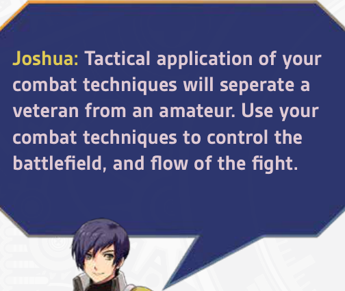
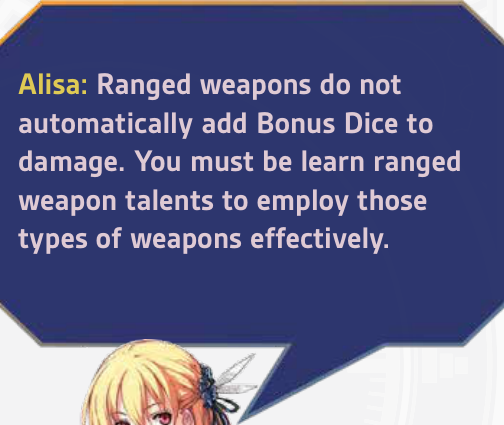
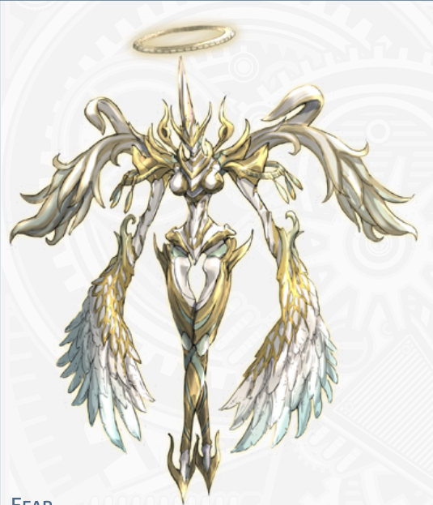

# 第三章——战斗与行动

Promethium 系统中的战斗旨在做到战术性强、惊险刺激且极具沉浸感。
其灵感源自《轨迹》系列激烈而动态的战斗。在这里，每个行动都至关重要，你的选择将决定每一次遭遇战的结果。
战斗的核心在于团队合作、走位，以及运用你独一无二的能力来智取和机动制敌。每回合你都要做出重要决定：是进攻、支援盟友、走位以获得更佳角度，还是使用你的招牌战技之一？战技是你武备的核心，由耐力或魔力驱动，并受你的适性增强。
战斗中的行动通过掷一个 d20，并加上来自技能、属性及其他来源的加值骰进行检定。你的目标是达到或超过 GM 设定的成功总和。成功意味着你的行动按计划奏效，而爆发加值骰时，效果会得到增强。
走位和射程的重要性不亚于原始伤害。每项战技都有一种范围类型，例如爆发、直线或锥形，使得移动对于命中多个敌人或保护盟友至关重要。也要留意破绽！这些战术机会将奖励团队合作，让你或你的盟友能够发动攻击并造成额外效果。
冲突不单是肉体上的。无论是瓦解敌人的士气，还是说服一个顽固的对手，社交与精神挑战也使用相同的机制，让所有角色都能大放异彩。

## 行动规则

所有需要检定的行动都遵循相同的公式：1d20（动作骰）+ 任意加值骰，对抗成功总和。VS加值骰通常为d10，除非你处于负伤状态或承受对该检定的挑战，此时它们的等阶会下降，从d10降至d8，再从d8降至d6；若你受到特别严重的阻碍，则从d6降至d4。加值骰最低不能降至d4以下，并且任何效果都无法降低你的动作骰，只能降低你的加值骰。

加值骰可以从技能加值、天赋或高属性值中获得。当有事物提升你的加值骰等阶时，例如在行动检定上获得充能或拥有特殊能力，所有来源的加值骰都提升一个等阶 —— 从d10升至d12，从d12升至d20。充能与挑战会以一对一的方式相互抵消，彼此中和。

当你将加值骰添加至效果检定（如伤害）时，这些加值骰仅在明确说明的情况下才会受益于充能效果，或受挑战影响。例如，处于负伤状态会降低所有行动检定和效果检定的加值骰等阶，但试图用远程武器击中远处的敌人只会挑战附加在攻击检定上的加值骰。

## 遭遇

冒险是件危险的事。你会发现，许多情况往往只能通过冲突或暴力来解决。当这种情况发生时，就称为一次遭遇。遭遇可能由GM事先计划，也可能是偶然发生的混乱事件。有时，玩家角色自身的行为也可能导致社交场面升级为一场遭遇。

一次遭遇被划分为回合与轮。一个回合是一名生物在其先攻顺位执行一连串行动的时段。当遭遇中所有生物都完成各自的回合后，一轮便告结束。在游戏中，每战斗轮约为15秒，但在现实中可能需要几分钟来理清。

**回合。** 在战斗白热化之际，一个回合只持续数秒，但在这段时间里，你将用完所有动作。当你所有动作都执行完毕后，便轮到下一个角色或生物，具体取决于先攻顺序。

**轮。** 与回合不同，轮的定义是一组人耗尽全部动作所需的时段，大约为15秒。任何以轮为单位列出持续时间的效应，都假定该单位是一个15秒的时间块。若某项行动所需动作数超过你在一回合内拥有的数量，你必须使用后续回合的动作来完成该行动，例如强大的法术。

## 攻击 vs. 强攻

在战斗中，威胁分为两类：攻击与强攻。
**攻击**是一种直接的物理威胁。如果敌人挥剑、开火、施展武术战技，或使用针对你**格挡**的物理技巧，那便是攻击。攻击代表你能看见并靠身体规避的力量。要阻止攻击，你必须使用**防御反应**，通过闪避、偏斜或格挡来应对，这消耗5点耐力。
**强攻**是一种魔法、精神或环境威胁。如果某个魔法、魔法战技、诅咒、毒素或超自然效果针对你的**守护**，那便是强攻。强攻代表的是压倒你身体或精神的力量，而非打击你的护甲。要抵抗强攻，你必须使用**抵抗反应**，这消耗5点魔力。
物理力量针对格挡，并以防御应对。超自然或内在力量针对守护，并以抵抗应对。

## 回合与轮的顺序

在你的回合内，你可以根据你拥有的行动次数执行任意数量的行动。这可以是任意组合；你可以将所有行动用于攻击，混合攻击行动与移动，移动与技能，或任意组合。只有施放魔法和使用战技可能需要一次以上的行动。
当你执行一个影响其他生物的行动时，例如进行攻击或试图说服他们，目标有权进行一次反应，如防御。如果他们没有任何可用的反应，该行动将不受对抗地继续，并施加效果。
一旦所有生物都按照先攻顺序采取了他们的行动和反应，就会应用恢复，下一轮开始。
恢复阶段。在一轮结束时，大多数生物会恢复一定数量的耐力，并可能恢复其他资源，如耐久和生命值。这就是恢复阶段。在此期间，资源再生会被应用。
命定。命定角色可以解放命定，在非玩家行动轮次期间执行一次额外的回合外行动。然而，由于这不是他们的回合，某些行动类型可能不可用。

## 先攻

当战斗开始时，所有希望行动的参与者投掷他们的动作骰，1d20。这就是你本轮的先攻值。天赋或技能可能添加加值骰，情境调整值同样可能。每一轮，所有战斗者按照先攻检定结果从高到低的顺序行动。

### 遭伏击

伏击情境是一组战斗者被另一组战斗者有意伏击，例如埋伏等候、从盲点攻击、或从隐藏或隐形位置攻击。当你遭伏击时，你在首轮开始时只能进行1个行动。

### 伏击

与遭伏击方相对的一面；当战斗者有目的地等待毫无防备的目标时，该战斗者获得伏击加值。攻击发动时，每位伏击者在首轮额外获得1个行动。

### 警戒

一个积极预期来自狭窄方向的攻击的战斗者被视为处于警戒状态。在此状态下，他们有点神经紧张，只要战斗从预期的攻击方向发起，他们在首回合的先攻检定上获得+1加值骰。相反，如果攻击从另一个方向发起，该警戒中的战斗者被视为遭伏击。

### 无力化

一个无力化的角色与其说是战斗者，不如说是受害者。无力化可意味着昏迷、被绑住或捆住，或被以无法移动或行动的方式压制。在这种情形下，该角色不能进行任何需要身体移动的行动，不能闪避或防御，如果被攻击很可能被直接杀死。

## 行动与反应

### 攻击与防御

当你对另一个生物发起攻击时——无论是用武器、战技还是魔法——你掷出动作骰（1d20）加上所有来自技能加值和属性值的加值骰。对于武器和徒手攻击，通常使用敏捷；对于魔法类战技和法术，则使用灵魂。一次攻击或强攻必须达到或超过目标的格挡或守护。任何低于此值的掷骰都视为未命中。

要用武器、武术战技或类似武器的魔法造成物理伤害，你的掷骰结果必须高于目标的格挡。格挡为15加上所有来自护甲和能力的加值。

要用魔法法术或战技命中，你的掷骰结果必须高于对手的守护。守护为15加上所有来自天赋和能力的加值。

攻击检定后，防御者可以选择使用反应，例如防御或抵抗。反应会消耗耐力或魔力，但允许防御者反击，掷出动作骰加上加值骰。如果防御者的掷骰结果高于攻击者，则成功防御并避开攻击。如果攻击者和防御者平手，则判攻击者胜出，攻击命中。

### 动作

你初始拥有2个动作。在你的回合中，你可以执行等于你动作数量的动作。你可以通过升级技能树和学习天赋获得额外动作。在你的回合中，你可以执行以下动作：

攻击。你使用手中的武器或自身的天生武器进行一次攻击。攻击检定是你的动作骰加上所有加值骰，对抗目标的格挡。

副手攻击。当你在回合中执行攻击动作或使用轻武器技巧时，你可以消耗8点耐力，作为同一动作的一部分进行一次副手攻击。副手攻击在命中加值骰和伤害上承受2点挑战减值。此攻击可以是使用副手所持武器的攻击，也可以是徒手攻击。

战斗技巧。如果你精通所持的武器，你不仅能进行普通攻击。熟练的战士能运用战斗技巧，例如强力打击、擒抱、近战射击和虚招。

防御。你进行防御时，进入格挡架势，并摆好姿势以便对预料中的攻击轻松做出反应，使你在下个回合开始前的第一次防御反应消耗的耐力减少2点。

逃脱。你从战斗中逃离。当你逃跑时，相邻的攻击者可以对你试图逃脱的行为做出反应，因为你在逃跑时会露出破绽。否则，你将脱离这次遭遇，并持续向远处移动。

移动。你移动一段战斗移动距离；此距离为10尺 + 每个速度加值骰5尺（2个六角格 + 每个速度加值骰1个六角格）。你可以任意执行多次移动动作。例如，如果你有三个动作，你可以用它们移动到一个敌人身边（第一个动作），用武器攻击那个敌人（第二个动作），然后移开（第三个动作）。无论你执行多少次移动动作，每次动作只能将你移动10尺 + 每个速度加值骰5尺的距离。

准备。在某种程度上，防御就是一种准备动作。当你准备动作时，你设定一个你正在等待的单一条件，并预设如果该条件在你下个回合开始前发生，你打算做什么。如果该条件发生，你可以用一个反应，以你准备好的动作来应对该事件。你只能通过准备来保存1个动作；需要多个动作的能力无法被准备，并且你在任意回合中都只能准备好1个准备动作。

使用能力。如果你拥有可以激活的技巧、法术或天赋，你可以在自己的回合中使用它们。某些能力需要消耗超过1个动作才能使用，且大多数会消耗耐力或魔力。

使用物品。你使用一个随身携带的物品，例如药水、遥控引爆器或魔法物品。

使用技能。你使用自己的一项技能。你可以尝试使用社交来魅惑敌人，使用警觉来找出弱点，或使用娱乐来鼓舞盟友。

### 格挡与守护

所有生物都拥有两个起始值为15的防御属性：格挡与守护。
格挡代表你的被动防御能力，通常指用武器或类似武器的攻击命中你的难度。大多数攻击都会以目标的格挡来结算。
守护代表你的意志力，以及抵御那些无需命中即可影响目标的攻击的能力。这包括许多法术和魔法攻击、毒素，甚至疼痛。

### 反应

当一个生物对你采取行动时，多数情况下你有权进行反应。然而，反应会消耗资源，这限制了你在一次遭遇中可以做出的反应次数。对于任何触发事件，你只能做出一次反应。如果你受到攻击，你只能针对那次攻击做一次反应。如果对手创造了一次机会，你只能利用那次机会一次。
**防御**。所有生物在受到一次它们知晓的攻击时，都可以使用此反应。掷出你的动作骰 (1d20)，加上你从速度中获得的任何加值骰。如果你的结果高于攻击者的掷骰，你便成功闪避了这次攻击。使用基础的防御反应消耗5点耐力，使用战技则消耗更多。
**抵抗**。所有生物在受到非物理魔法影响时，都可以进行抵抗反应检定。掷出你的动作骰 (1d20)，加上目标属性（如意志或体魄）带来的任何加值。如果你的结果高于攻击者的施法掷骰，你便成功抵御了魔法。使用抵抗反应消耗5点魔力。
**抓住机会**。当对手创造了一次机会，如果你在相邻位置或射程内，你可以消耗5点耐力，用武器或徒手进行一次攻击。当你使用某些战斗技术、尝试逃跑，以及在其他一些情况下，你会为他人创造攻击的机会。
**准备动作**。当你在自己的回合准备一个动作后，你可以利用对某事件的反应来执行你准备好的动作。你在任何给定时间只能准备1个动作，并且对于任何事件你只能做出1次反应。
**特殊反应**。许多技能树和天赋可能会赋予你额外的反应，或改变你进行反应检定的方式，例如偏斜和格挡。

### 在战斗中使用命定

在战斗中，处于命定状态是一个强大的优势。处于命定状态时，你可以随时解放你的命运，以：
*   用+3加值骰来强化一个动作。这对于造成重击、进行抵抗检定或防御极为有利。
*   立即执行一个动作，如攻击、移动或反应等，即使不在你的回合内。
*   恢复一项核心资源的¼；耐久、耐力或魔力，让你能够继续战斗。
*   触发你的S战技，释放你角色的终极能力。
命定旨在反映转折点，在戏剧性的时刻使用它，当你的角色的意志让他们能够突破技能或运气的极限时。
你无法通过解放命运或在其生效的同一回合内成为命定状态，但抓住机会并勇于冒险，就能确保你保持命定！

## 战斗技巧

除了简单的攻击和防御之外，战斗技巧是你在精通所持武器时可以运用的机动战术。技巧可以用于攻击、防御、改变态势或变更位置。当你使用技巧时，会消耗一定量的耐力。若耐力不足以支付能力的消耗，则无法使用该技巧。

### 防御技巧

这是任何拥有新手防御的人都可以使用的基本防御反应。
闪避
耐力：8
你通过重新站位来躲避即将到来的攻击。成功时，该攻击未命中，且你向任意方向移动5英尺。
格挡
耐力：8
你使用武器或盾牌偏转攻击。投掷防御，并将你的装备加值（例如盾牌、格挡武器）加入检定。成功时，攻击被无效化；平局时，伤害减半。
硬抗
耐力：5
你正面承受攻击，稳住身形抵抗。投掷防御并获得+1加值骰，成功时，无论武器特性如何，将受到的伤害降低1d8。失败时，你仍可根据护甲等阶降低受到的伤害。

### 抵抗技巧

这是任何拥有新手抵抗天赋的人都可以使用的基本反应。
忍耐
魔力：8
你凭借纯粹的蛮力抵抗物理性非武器攻击（擒抱、击晕、击倒、毒气）。即使失败，也能将该状态持续时间减少1回合，或让保持此攻击的攻击者承受1层挑战。
克服
魔力：8
你坚定心智，抵抗恐惧、魅惑、幻象或精神入侵。成功时，你不仅无效化该攻击，并且直到下一回合结束前，免疫所有要求记忆、共感、理性或意志检定的攻击。
法术反制
魔力：特殊
以可见范围内正在施放导力魔法、法术或仪式的对手为目标，且其吟唱窗口可辨识并以你为目标时，你可尝试法术反制抵抗反应。与普通抵抗反应不同，在掷骰前你必须宣告所消耗的魔力或E.P.。施法者正常结算其施法检定（神秘学或导力魔法）。然后，比较你所消耗的魔力，若至少为施法消耗的1/4或更多，你可投掷法术反制抵抗，若击败施法检定，则该法术被完全抵消。若你消耗的魔力至少为施法消耗的2倍，成功时魔法将反弹回施法者。

### 近战技巧

这些基础战斗机动战术任何拥有新手轻武器、重武器或徒手格斗天赋的角色都可使用。
动作消耗。除非另有说明，否则一个技巧在你回合内消耗1个动作。
强力攻击
耐力：6
你对对手发起凶狠的全力攻击。消耗6点耐力，可使此次攻击的伤害加上+1加值骰。若你将突进与强力攻击连携，则额外再+1加值骰伤害。
佯攻
耐力：3+
佯攻是一种战术虚招；你摆出一种攻击的架势，同时却为另一种攻击布局。当你使用此机动战术时，可令对手对此攻击的防御反应检定承受1至3点挑战，你每制造一点挑战消耗3点耐力。若目标选择不防御，佯攻将变得愈发致命。你选择对防御制造的每一点挑战，在攻击不设防的目标时都会为你此攻击增加1颗武器骰的伤害。
擒拿
耐力：6
擒拿技巧是一种牵制手段，不造成伤害，但会改变你和目标的态势。使用你的武器或徒手技能进行一次攻击检定。命中时，你成功擒拿对手。擒拿成功后，你可进行一次无法被闪避的副手或次要武器攻击，或使用后续技巧。擒拿是执行任何种类的固锁、投掷或压制所必需的。第一回合后，你可选择消耗2点耐力维持擒拿。无需掷骰，除非目标尝试以抵抗（力量）检定对抗你的力量属性值以挣脱固锁。
近战缴械
耐力：5
徒手对武装：当双手空置时，你可在近战攻击中尝试缴获敌人武器。你正常进行徒手格斗攻击检定。若攻击失败或目标成功防御，你会为那个对手制造破绽，目标可对你进行一次攻击。否则，你缴械对方，现在持有其主手武器。
武装对武装：当两个武装对手对峙时，缴械功能类似：你进行攻击检定，目标防御。成功时，对手的武器从其手中被击落，朝随机方向飞出5英尺（1格）。然而，若你缴械失败，防御者无权利用破绽。

Joshua：战术性地运用你的战技，将使老兵与新手区分开来。运用你的战技来控制战场和战斗的节奏。

绊倒
耐力：6
通常以踢击或使用如杖、枪等武器进行，但任何武器都可以绊倒。通过绊倒技巧，你打击、横扫或缠绕对手的腿部，使其失去支撑而倒地。相比冲撞，绊倒的优势在于攻击者能保持距离和平衡。绊倒如同普通攻击一样进行：若成功，目标被击倒。目标可以尝试正常防御。

疾冲
耐力：9
你全力冲刺突袭一个目标，至少移动总速度的一半，然后猛撞目标或在撞击时使用其他技巧。如果你仅花费1个动作进行疾冲，你以身体冲撞目标，造成徒手伤害并将其击倒。如果你有足够的动作，可以花费1个动作作为疾冲的后续，用武器攻击或使用其他技巧。如果后续攻击命中，目标被击倒。如果你疾冲一个敌人并接续一次强力攻击，你的强力攻击将造成+1个加值骰的伤害。

### 远程技巧

这些基础远程技巧对任何拥有远程武器新手天赋的人开放。它们不仅关注瞄准远程武器，还涉及在混合战斗情况下作战的实际状况。

近身射击
耐力：9
你用远程武器打击邻近的敌人，然后射击他们。这次攻击需要一次使用你的远程武器技能和敏捷的近战攻击检定。如果你的目标成功对这次近战攻击做出Deflect（但其他防御反应不算），则这次射击被浪费。否则，命中时你造成1d6（或刺刀）的近战打击伤害，且除非目标进行Deflect，否则受到正常的远程武器伤害，并为你的武器伤害加值骰提供1点充能。
如果你在疾冲后使用近身射击，你可以将力量加值骰加入打击伤害。

接续射击
耐力：15
使用该技巧，你一边在近战中用远程武器进行一次远程攻击，一边立即脱离。你的攻击在命中上承受1个挑战。然而，在该动作结束时你已向后退开10英尺。这时你可以逃跑，并且不会制造破绽。

击倒射击
耐力：15
这种近战射击用于绊倒并终结一个敌人。你进行一次迅速的佯攻，然后用武器绊倒对手。这是一次远程武器（力量）检定来命中。除非对手防御，体型与你相同或更小的生物会被击倒并陷入俯卧，你立即发射一次准备好的射击，这次射击为你的武器伤害加值骰提供1点充能。如果你最初的绊倒未命中，该技巧被浪费。

弧线射击
耐力：10
这基本上是一种花式射击，你发射武器使弹道横向弯曲。这允许你“绕过拐角射击”，无视具有部分掩体的目标的防护，只要目标处于长射程内。

### 徒手技法

以下基础武术技法对所有拥有新手徒手格斗天赋的角色开放。这些技法利用体重、杠杆和旋转来为徒手攻击（如拳击、肘击、踢击、膝撞和投技）增加威力。

**无形刺拳**
耐力：3
以你的前手（最靠近对手的手）打出一记快速有力的刺拳。虽然它造成的伤害与普通徒手打击相同（不计调整值），但刺拳的关键在于它不会暴露攻击意图，使对手更难以防御。尝试防御你无形刺拳的对手，其防御检定承受1点挑战。

**碎骨掌**
耐力：6
通常用于近身缠斗，这一击能有效地将力道穿透防护，传递到对手体内。一次碎骨掌打击忽略生物目标的护甲等阶，并对物体和构装体造成双倍伤害。

**蹬踹**
耐力：6
蹬踹有两种用途：用于破坏站立对手的平衡或将其击退，或是对固定目标和物体造成毁灭性打击。施放蹬踹时，先提膝至胸口，再以脚底发力，将脚蹬出，踹向对手身体中心。对站立对手命中时，每有1颗力量加值骰，该踢击便造成1点伤害，并且与你的体型相同或更小的目标会被击倒，并被推后5尺，你每有1颗力量加值骰，额外推后5尺。对被固定或束缚的目标（如被绑在树上的对手或一扇锁着的门），则造成完整的徒手伤害，并额外造成+1颗加值骰的伤害。

**快踢**
耐力：5
与蹬踹类似，这一攻击也是通过提膝至胸口并将脚蹬出来完成。然而，快踢的力量源自速度和腿部的爆发力，而非腰跨和体重。此外，快踢通常只使用脚掌前部接触目标。快踢不将力量加值骰加入伤害，但它速度极快且收招迅速，允许你以1行动进行两次踢击。

**回旋踢/后跟踢**
耐力：9
此招式得名于武术家进行全身旋转的动作，将腿带起，以支撑脚的脚掌为轴转动全身。旋转结束时，以胫骨作为攻击的接触点。后跟踢则是向相反方向旋转，以脚跟接触。此攻击虽然缓慢且易于闪避，但威力惊人，造成+2加值骰的伤害。防御者在抵抗回旋踢的防御检定中获得一次充能。

**新月踢**
耐力：6
此招式起始动作与侧踢完全相同，然而你并不直接将脚蹬向对手，而是先向侧面踢出，再骤然将脚以脚跟朝前的方式鞭甩回来，击向防御者。该攻击难以防御，目标的防御检定承受1点挑战减值。

**过肩投**
耐力：5
通常被视为擒拿武术中的首选投技，这一高难度投技利用对手前冲的惯性和力道，将其从肩头摔出。与多数技法不同，你只能以反应的方式来使用过肩投；尝试此投技的角色必须以承受1点挑战减值的方式，对一次来袭的近战攻击进行防御（格挡）检定。若成功，该次攻击被格挡，对手被提离地面，越过你的肩头，摔向地面。攻击者承受1d10点固定打击伤害，并变为倒地状态。

**腰车**
耐力：6
此投技通过操控目标的重心，使其旋转并摔倒在地。这通常需要降低自己的重心，并以髋部作为杠杆或支点。命中时，你将该目标摔向地面，造成1d10点固定打击伤害，并使其变为倒地状态。

**大力抛投**
耐力：7
此技法纯粹凭借力量将一名被擒抱的对手举起并掷出。要施展此技法，你必须已擒抱目标，且其重量须在你的最大举起值之内。此时你有两个选项：
头向抛投：你将目标扔出5尺远。目标受到2d10点打击伤害（无加值骰，体型每比中型大一级，+1d10）并倒地。
瞄准抛砸：你将目标当作武器使用，掷向另一个目标，这需要一次常规的远程武器攻击检定。只要被砸向的目标体型与抛出的牺牲者相同或更小，则目标和抛出的牺牲者各受到1d10伤害，且两者均变为倒地状态。若被砸向的目标体型更大，则仅抛出的生物受到1d10伤害并变为倒地状态，而目标不受影响。抛出牺牲者的射程为5尺，你每有1颗力量加值骰，额外增加5尺。

## 位置与触及

在整个回合中，你与对手皆可采取行动来移动并改变自身位置，或承受会将他们击退或击倒的攻击。这会改变你的近战武器或攻击能够命中谁、你如何结算一次攻击，或你如何移动。

### 接战区域

在战斗遭遇中，一个生物的接战区域为其周围5尺（1个六角格半径）。不脱战便离开此区域会创造**破绽**（Opening）并触发**反应**（Reaction）。拥有触及的生物会将此区域增大至10尺（2个六角格）。

### 位置

**相邻**。当生物位于彼此5尺范围内且之间存在畅通路径时，即为相邻。在六角格网格上，一个生物最多可以与6个其他生物相邻。掩体、墙壁与障碍物会阻碍生物被视为相邻。
**后方**。从正面、侧面或后方攻击与防御并无特殊规则。但若你在未察觉的情况下遭后方攻击，或你在对手未察觉时自后方攻击，均会影响**防御**（Guard）。当你未察觉敌人而遭后方攻击时，你的防御减半（向上取整）。当你自后方攻击对手时，该对手的防御减半（向上取整）。一般而言，这意味着一次后方攻击须对抗的防御值为8而非15。

### 触及

小型、中型与大型生物的触及为5尺（1个六角格），这也是其接战区域。这即是为了不花动作移动就能在自身回合以武器或徒手发动近战攻击所需接近的距离，也是企图逃跑或暴露身形的敌人创造破绽的距离。长柄武器与链兵器等武器可能改变这一距离。

### 击倒

被足够猛烈的攻击击中或脚下失去依托的角色会被击倒。若此状况发生在该角色的回合，会使其当次动作无效，且该角色必须花费一个动作从倒地状态起身。在你被击倒且倒地期间，你的速度在计算移动时降为1/4，且你的防御减少5。不过，对你进行的远程攻击会承受1点**挑战**（Challenge）。

### 架势

能够改变你或对手位置的战斗动作会改变你的架势。架势本身极少产生即时效果，而是为后续攻击做好准备。例如，**防御架势**会降低防御动作的消耗；而**擒抱**则会同时改变你和对手的架势，让你得以衔接强力攻击、投技或令对手无力化。某些能力或许只有在你采取特定架势后才能使用。

### 使用六角网格

若你的团队使用微缩模型、标志物或虚拟桌面软件，则使用六角网格或方格网格可以为移动、定位、触及及范围效果提供清晰的空间规则。每个六角格或方格边长为5尺。角色的移动以尺与格子来表达，便于规划路线、控制空间与在战斗中执行策略。

## 资源与回复

在每一轮中，你将消耗耐力与魔力来使用你所拥有的能力；而当你受到攻击时，你将损失耐久并可能损失生命值。但在每一轮结束后，会出现一个短暂的恢复期，让你恢复继续战斗所需的能量。

### 力竭

很多行动可能需要你消耗耐力。如果你的耐力耗尽，你会陷入力竭状态，无法进行任何行动。该状态持续到你至少恢复5点耐力为止。

### 回复

在每一轮结束时，所有战斗者都会获得回复的益处。
耐力：你每有5点体魄，即可恢复1点耐力。
耐久：如果你有特殊能力，可以恢复一些耐久。
魔力：如果你有特殊能力，可以恢复一些枯竭的魔力。

## 伤害

武器与造成伤害的攻击性能力均具有伤害值，通常简称为伤害。伤害值通常为固定值，例如1或3。这是该武器或能力进行伤害检定时掷出的骰子数量。掷出的骰子类型取决于攻击的品质等阶；一把普通长剑造成d8伤害，一把英雄战斧造成d10伤害，以此类推。

### 武器伤害加值

当你使用徒手攻击、近战武器——或部分远程武器（若你拥有相应的天赋）——命中目标时，你将你的力量加值骰加入伤害。
若你拥有足够的技能等级和必备天赋，当你使用弩、现代武器或魔法投射物命中目标时，你可以将你的技能加值骰加入伤害。

### 亚莉莎：远程武器并非

### 自动将加值骰加入

### 伤害。你必须学习远程

### 武器天赋才能有效运用

这些类型的武器。

### 生命值与耐久

当你受伤时，你承受伤害。活着的生物在受伤和陷入休克之前，能够承受一定量的伤害。伤害首先从你的耐久中扣除。当你的耐久降低至0时，你陷入负伤状态，并开始从你的生命值中扣除伤害。
耐久。对耐久造成的伤害通常不危及生命。这代表你能够承受轻微攻击，以及强行撑过伤痛的能力。除非你陷入负伤，否则耐久会迅速恢复。
负伤。一旦你承受了足够的伤害，使你的耐久降低至0，你便陷入负伤状态。在负伤状态下，某些技能或天赋可能会生效，并且你会变得容易受到某些技巧和法术的影响。然而，陷入负伤最重要的效果是，你不再能快速恢复耐久，且你的加值骰向下移动一级（英雄d10变为普通d8，等等）。一旦你陷入负伤，任何你承受的伤害都可能是对你生命值构成潜在威胁的伤害。
生命值。一旦你陷入负伤，或当你受到毒素等特殊攻击影响时，你承受的任何伤害都将作用于你的生命值。你的生命值恢复非常缓慢。当你的生命值降低至0时，你将失去意识，除非立即接受医疗救治，否则会死亡。在你生命值为0时受到的任何伤害都会立刻杀死你。
超额伤害。如果你遭受的攻击会使你的耐久降为负值，那么一旦你的耐久达到0，该伤害便会继续作用于生命值。然而，如果你还拥有生命值，却遭受会使生命值降为负值的攻击，那么你的生命值将降到0并陷入休克状态。

### 暴击

所有加值骰在你掷出其最大值时会爆发，这包括造成伤害的加值骰。当你的一颗或多颗伤害加值骰爆发时，这被称为一次暴击。

### 护甲等级

防护性护甲提供一种被称为护甲等级的伤害减免。你减少等同于你护甲等级的即将受到的伤害。如果你从不同来源获得两个或更多护甲等级，你可以将它们叠加。例如，如果你有一个魔法效果赋予你6点护甲等级，同时你还穿着一件拥有4点护甲等级的轻甲，你的总护甲等级为10。然而，通常你不能叠加同类型的护甲或赋予护甲等级的相同魔法。

### 品质与伤害

武器和护甲都有品质。当较高品质武器的攻击命中较低品质护甲时，该护甲会被忽略。反之，当较低品质武器攻击较高品质护甲时，护甲不会受到损伤。从英雄品质开始，武器会忽略比自身品质低三阶的护甲，而护甲会对低于自身三阶或更多等阶的武器伤害免疫。
高级耐久 同样地，异常危险的敌手与强大的能力可能赋予高级耐久，例如英雄、史诗甚至传说级耐久。任何拥有该特性的存在免疫来自不及自身等阶或更高品质武器的伤害。要伤害拥有英雄级耐久的生物，需要英雄或更高品质的武器；要伤害拥有史诗级耐久的生物，需要史诗或更高品质的武器。通常能量伤害能够穿透高级耐久，但也并非总是如此。

### 伤害类型

在命运之轨迹中，所有攻击、法术与效果皆归属于七种元素类型之一。了解这些元素特性对针对敌人弱点或强化自身防御至关重要。武器与攻击的伤害类型会在防护对特定类型攻击提供更好或更差效果时发挥作用。
例如：普通护甲能防护热伤害，如同防护武器攻击一般。反之，电击类伤害有时会穿透普通护甲，但塑料或橡胶护甲对电击攻击可能拥有较高的护甲等阶。此外，敌人可能仅针对特定伤害类型拥有护甲等阶，或完全免疫。
Chemical
此类伤害来自能够快速灼烧并侵蚀物质或肉体的强酸或强碱。
Cold (Cryo)
接触零下温度，例如冰与水属性魔法、液氮喷洒或冷冻投射物，将造成冰冻伤害。缓速效果会使目标变脆或阻碍行动。
Divine (Holy)
天界能量的显现、圣遗物或祝福造成神圣伤害。此类力量能强化盟友或借助璀璨的干涉贯穿邪恶势力。
Earth (Geo)
物理与元素之力，将敌人压制并碾碎。通常由耐久度和专门的地属性抵抗所减免。
Fire (Ignis)
暴露于高温或火焰魔法，例如燃烧武器或爆炸物，会造成火焰伤害。灼烧造成持续的伤害，并可引燃周遭环境。
Lightning (Voltic)
由高压魔法或导电投射物释放的电流造成闪电伤害。电弧会在敌人之间连锁，干扰协同或烧毁精密设备。
Mirage (Illusio)
基于心理与感知的伤害，打击精神与情绪状态。守护与精神抵抗提供主要的减免手段。
Pierce
许多魔法、箭矢、矛或子弹造成的穿透性打击造成穿刺伤害。此类攻击将力量集中于小范围以最大化穿透深度，从而绕开表层防御。
Poison (Poison/Thorn)
具有毒性性质的伤害本质上是生物的，尽管其传递方式可能并非如此。纯粹的毒性伤害未必会损毁护甲，而可能只伤害活体生物。
Slash
锋刃武器造成的割裂或撕裂，如剑、爪、旋转刀刃及类似攻击，造成斩击伤害。这些攻击能精准切断血肉、护甲或其他材料。
Sonic
来自爆炸或定向音爆的强力震动或声波造成音波伤害。其效果可震破耳膜、破坏平衡或粉碎结构。
Space (Spatio)
扭曲现实，通过压缩或空间扰乱造成伤害，可绕开传统的防御手段。特殊的空间屏障或力场能提供抵抗。
Strike
锤、拳头或重型物体的钝击，以及大多数地属性魔法造成打击伤害。此类攻击造成粉碎性力道，以纯粹的力量击碎骨骼、护甲或结构。
Time (Chrono)
操纵性能量，减缓或加速行动，可扭曲或撕裂物理形态。减免需依赖时序稳定性与抵抗。
Water (Aqua)
治愈、净化与适应之力；既可通过侵蚀伤敌，又可用恢复强化盟友。
Wind (Aero)
迅捷而精准的伤害，风能穿透防御并重新定位目标。由特定的风属性防护所降低。

### 徒手攻击

大多数人形生物并没有如爪牙般的天然武器。对于人类和人形生物来说，徒手攻击（如拳打脚踢）造成1微弱（d4）冲击伤害（外加力量加值骰），除非你受过武术训练。卓越的武术造诣可以大幅提升这一伤害。

### 物体与构装体

万物皆有耐久，即使是物体。当你攻击一个物体或构装体时，你对它的耐久造成伤害。一些由特别坚硬材料构成的物体也可能拥有天生护甲等阶或高等品质。对于物体来说，低等品质的武器根本无法伤害高等品质的物体。特别复杂的物体，如活体构装体和有人驾驶的机械，还可能拥有 Integrity 而非生命值。此外，当一个无生命物体的耐久耗尽时，它将被毁坏到无法有效使用的程度。

## 死亡

冒险是危险的工作。怪物、人类与灾难都可能威胁你的生命。当你的生命值降至0时，并不会立即死亡，但会陷入休克并面临严重的死亡风险。处于休克中的生物已踏入死亡之门，将在等同于你的体魄值的轮数内死亡。若你在生命值为0时再受到任何伤害，则会当场毙命。

对于陷入休克的生物，可进行难度为20的医药检定将其伤势稳定。一旦伤势稳定，你将不会在固定轮数后死亡，但仍会处于昏迷状态，直到你恢复至少1点生命值。即使伤势已经稳定，在生命值为0时受到任何伤害仍会立即导致死亡。

## 状态与干扰

角色可能会遭受数种损伤与障碍。当你处于这些状态之一的影响下时，会在一种或多种情况下承受某种机制上的显著劣势。

### 从状态中恢复

大多数状态都有设定的持续时间，然而，在每个回合的恢复阶段，你可以选择消耗魔力进行一次抵抗检定，对抗你所承受的一个生效中的状态。通常情况下，你在每个恢复阶段只能抵抗1个状态。

### 灼烧

灼烧由持续的火焰伤害或被可燃液体浸透所引起。在你的回合开始时，除非你在回合结束时的恢复阶段采取抵抗反应，否则你会承受一定数量的d8火焰伤害。d8的伤害数量由造成灼烧的攻击决定。一旦你成功通过检定，灼烧状态便终止。如果你受到寒冷伤害、被水浸透、或遭受冰冻状态，灼烧也会终止。

### 冰冻

你被冰禁锢（见下文束缚）。在你的回合开始时，你承受1d8寒冷伤害。如果你在回合结束时的恢复阶段采取抵抗反应，或受到火焰伤害，冰冻状态便会终止。

### 石化

你正逐渐被弱化的石头或盐包裹，并陷入束缚状态。只有治疗药物和魔法能逆转此状态。你的格挡降至0，攻击无视你的护甲，且你无法采取大多数反应。

### 封印

在持续时间内，你无法动用耐力和魔力，这意味着你不能使用技法、战技或反应。

### 魔法封印

在持续时间内，你无法启动导力魔法，也无法与导力机械装置互动，包括至宝和导力武器。

### 中毒

受此状态影响时，除非你以一个动作使用解毒剂，否则在持续时间内，你的回合开始时将直接承受1d4生命值伤害。如果你在回合结束时的恢复阶段采取抵抗反应，可以终止中毒。

### 混乱

由魔法和幻术引起。在此状态下，你失去方向感，且在所有理性、记忆、共感和意志检定上有2个挑战。你难以辨别敌友，并可能攻击你的盟友。如果你在回合结束时的恢复阶段成功通过抵抗反应，可以终止混乱。

### 流血

此状态会造成持续流血的开创性撕裂伤，持续该效果的设定时间。遭受流血的生物在其回合结束时，将根据流血效果承受一定数量的d6伤害。造成流血的效果会将此数量列为流血 (1) 或流血 (2)，代表骰子的数量。

### 致盲

当你因强光或受伤而致盲时，会承受与身处完全黑暗中相似的惩罚。任何依赖视觉的动作，其VS提高+15。

### 眩晕

当你遭受严重的定向障碍或炮弹休克时，你会陷入眩晕。毒素、疼痛以及对头部的重击都可能导致眩晕状态。当你眩晕时，你只有1个行动，且你所有动作的加值骰都承受1个挑战。

### 目眩

当你被感官冲击轰炸时，就会陷入此状态。目眩带来的惩罚只能通过移除、屏蔽或中和效果来源来解除。目眩效果会妨碍专注和集中力，为大多数行动增加1个挑战。在战斗中，目眩的角色每轮可用的动作数比正常情况下少一个。

### 耳聋

陷入耳聋状态后，你将无法进行与听觉相关的警觉检定，并且除了通过手势或手语之外，无法进行交流。

### 负重

一个中型生物可以无显著影响地举起并携带其力量属性值10倍的磅数。当你超重，即试图在携带超过你举起值1.5倍的任意重量时进行移动，你所有基于敏捷、速度和体魄的行动检定都会受到2个挑战惩罚。此外，你只能以正常速度的一半移动，且在战斗中的移动距离减半，奔跑速度减半，并且你无法跳跃超过正常跳跃距离一半的距离。
你可以消耗耐力来硬拉并举起你举起值1.5倍到2倍之间的任意重量。你可以消耗10点耐力将这个重量举起1轮。每一轮，如果你还有耐力，你会消耗10点耐力来维持这个重量。在持有此重量时你无法移动。

| 体型   | 举起值   | 负重上限         | 硬拉上限       |
| :----- | :------- | :--------------- | :------------- |
| 微型   | STR x 1  | 最高 STR x1.5    | 最高 STR x 2   |
| 小型   | STR x 5  | 最高 STR x2.5    | 最高 STR x 10  |
| 中型   | STR x 10 | 最高 STR x 15    | 最高 STR x 10  |
| 大型   | STR x 15 | 最高 STR x 22.5  | 最高 STR x 30  |
| 超大型 | STR x 30 | 最高 STR x 45    | 最高 STR x 60  |
| 巨型   | STR x 75 | 最高 STR x 112.5 | 最高 STR x 150 |

### 受控

陷入受控状态会部分剥夺生物的自由意志。当你被受控时，除非受到控制你的存在的指示，否则你无法采取行动。如何执行你收到的命令取决于你，因此更开放的要求可能允许你逃离你的控制者。任何直接导致自我毁灭或会对你造成严重困扰的命令，例如强迫你谋杀你所爱的人，都有权让你进行一次抵抗反应来对抗。模糊的命令由GM裁定，“拦住那些入侵者！”可能不会引发抵抗检定，但“和他们死战到底”则可能会。

### 疲乏

在极端情况下，生物可能会遭受疲乏，一种显著虚弱的状态。疲乏可能由疾病、吸取生命的魔法和饥饿等因素引起。每一级疲乏都会为所有行动增加一个累积的挑战，就像负伤一样，同时还会带来其他障碍。一个生物最多可以累积4级疲乏，但如果他们累积了第5级疲乏，就会死亡。
具有疲乏等级的角色会承受相当严重的惩罚。摆脱疲乏的最简单方法是休息。每经过一整夜安稳的睡眠，进行一次抵抗检定VS 20，以从一级疲乏中恢复。你每天只能通过这种方式恢复1级。

### 恐惧

很少有像恐惧这样令人分心和虚弱的事物；它能让最强大的战士变得软弱，将一队训练有素的刺客变成无助的傻瓜，甚至削弱最强大的英雄。
不安。这种恐惧源于一种令人不安且无处不在的危险或威胁感。虽然这些是不同的情绪，但其根本的恐惧效果是相同的：专注力下降、神经质，以及更容易受到情绪攻击。当你承受不安时，你所有的精神行动检定都会受到1个挑战。此外，你不能对情绪攻击或惊吓进行抵抗检定。
惊骇。许多事物能引发惊骇：被凶恶的生物攻击，或目睹骇人的酷刑。当面对惊骇时，你必须进行一次抵抗反应，否则会因恐惧而冻结一回合。VS由惊骇的来源决定；许多恐怖怪物都有特定的惊骇VS，引发惊骇的法术也是如此。然而，相同的刺激只能引发一次惊骇。在最初的恐惧之后，角色会免疫（如果他们还活着）该特定来源的惊骇。
惊慌。被施加惊慌的生物会被驱使以最大速度或通过其最快的移动方式逃离恐惧来源，持续整整1轮或更长时间。需要进行一次抵抗反应检定才能站定并面对眼前的危险。克服惊慌的生物将在1轮内对该效果免疫。

### Restrained

被捆绑或擒抱可能导致此状态。当你处于 Restrained 状态时，你的移动速度降低至5尺（1格）。对你进行的近战攻击获得1点充能，同时你在速度和敏捷检定上承受1个挑战。

### Sickened

因身体受到危害（例如中毒或疾病）会导致 Sickened 状态。当你处于 sickened 状态时，你的物理动作承受1个挑战，并且你恢复耐力的速度减半。

### Unconscious

当你处于 Unconscious 状态时，你不能执行动作或反应，也无法感知周遭情况。你的格挡降低到0，攻击忽略你的 armor rank，除非它是魔法的，并且你无法主动抵抗或移动。

### Winded

当你将耐力耗竭至0，在短时间内达到身体极限时，你变为 Winded 状态。当你处于 winded 状态时，你在战斗中无法执行任何动作。在遭遇之外，你只能以缓慢步调移动和交谈，直到你恢复至少5点耐力。

### 负伤

当你的耐久降低至0时，你变为负伤。在负伤状态下，某些技能或天赋可能生效，你也可能容易受到某些效果的影响。当你负伤时，你所有动作检定承受1个挑战。你负伤后受到的任何伤害均可能对生命值造成危及生命的伤害。负伤时，如果你的生命值已受到任何伤害，你无法恢复耐久。

## 情景调整

许多情况会改变遭遇战的发展方式。

### 体型

体型很重要：许多衍生属性在不同体型下会有不同的表现。体型共分为七类：微型、小型、中型、大型、巨型、超大型和超巨型。人类是中型生物，一头灰熊是大型生物，而蓝鲸则是超大型生物。
体型类别
体型类别通常由质量和体积决定。通常，体积比质量更重要：一个直径十五英尺、充满热空气的球形生物是巨型生物，即便它的重量不过几百磅。
微型：中位质量小于2磅，总体积6立方英寸。
小型：中位质量小于60磅，总体积2立方英尺。
中型：中位质量小于450磅，总体积5立方英尺。
大型：中位质量小于3000磅，总体积15立方英尺。
巨型：中位质量大于250,000磅，总体积35立方英尺。
超大型：中位质量大于200,000磅，总体积100立方英尺。
超巨型：中位质量大于100万磅，总体积400立方英尺。
攻击与防御：不同体型
当体型较大的生物攻击体型较小的生物时，较小生物的格挡值每相差一个体型类别便增加5。例如，一个中型生物（如人类）攻击微型生物（如老鼠）会更加困难，老鼠的格挡为+10（2个体型差）。同样，一个超巨型生物（如贝希摩斯）攻击中型生物（人类）需要击破人类的格挡+20（4个体型差）。然而，在这两种情况下，大型生物的一击都可能直接杀死较小的对手。

### 能见度

大气中损害视距的条件会对远程攻击和驾驶技能造成惩罚。能见度条件可能由诸多因素造成，但通常是天气、烟雾或蒸汽所致。能见度条件分为正常、降低、低和零能见度四个等级。
正常能见度。正常能见度下无任何变化。无遮挡的视线距离在800英尺到1200英尺之间。
降低能见度。视野范围在70至100英尺之间。例如中等雨雪、消费级烟雾弹的烟雾、稀疏植被或薄雾。尝试驾驶、导航或类似行为的角色承受+5 VS惩罚。远程攻击的射程被限制在300英尺内，且命中目标有+5 VS惩罚。
低能见度。视野范围被限制在30至50英尺之间，例如大暴雨、火灾浓烟、大多数雾天或茂密植被。驾驶和导航承受+10 VS；远程攻击精度被限制在150英尺内，所有远程攻击命中时承受+10 VS惩罚。
零能见度。视野范围被缩小到5至10英尺之间；由浓烟、浓雾、暴风雪或极其茂密的植被造成。靠视力驾驶基本不可能，并承受+15 VS。远程攻击精度被限制在30英尺内，命中承受+15 VS惩罚，但在距离10英尺及以内的贴身射击时无惩罚。

### 掩体

障碍与阻隔可以是任何物体，从层层枝叶到水泥墙壁。掩体分为三类：轻型、部分和完全。当远程攻击者瞄准的目标有物体遮挡其位置、充当盾牌或两者兼有时，掩体规则便生效。

**轻型掩体**：轻微障碍，例如身处灌木丛或叶簇中，或位于伪装网下。攻击者通常仍大致知晓目标所在，但并非精确位置，且掩体本身不具备阻挡力。轻型掩体为目标对抗直接远程攻击的**格挡**提供+10加值。范围攻击不受影响。

**部分掩体**：蹲伏在树桩或混凝土路障后提供部分掩体。你仍可被看见，但掩体能阻挡部分攻击。当你拥有部分掩体时，你的**格挡**获得+3加值，且你对攻击的**护甲等阶**获得+5加值。此伤害由你的掩体承受。

**完全掩体**：躲藏在水泥柱或墙体后并留有射击位。完全掩体会遮蔽你的位置，并使你的**格挡**获得+5加值。假设你的掩体足够坚固，你对远程攻击的**护甲等阶**获得+10加值。此伤害由你的掩体承受。虽然这限制了你对需要视线的攻击的脆弱性，但更高威力的武器或许能击穿你的掩体。

