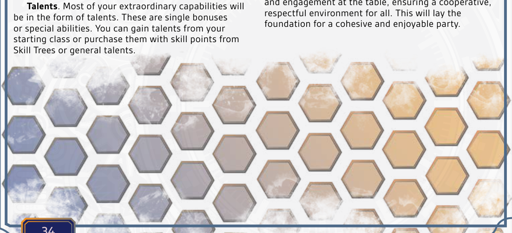
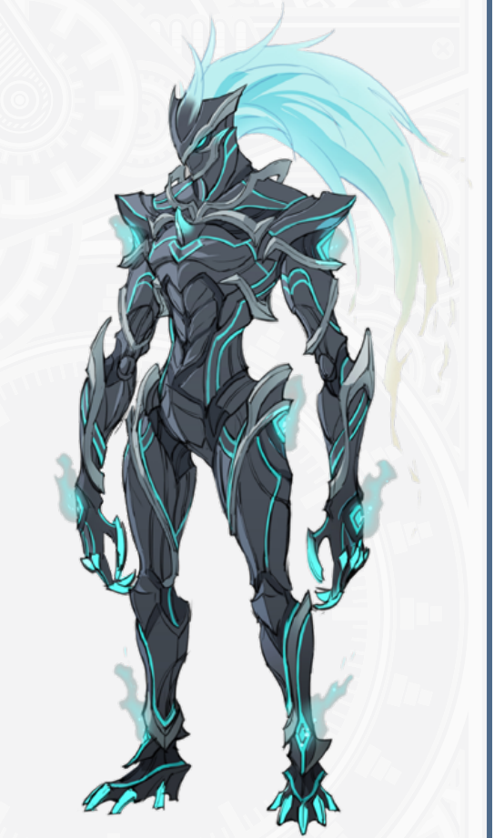
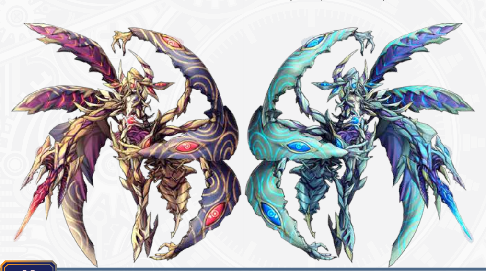
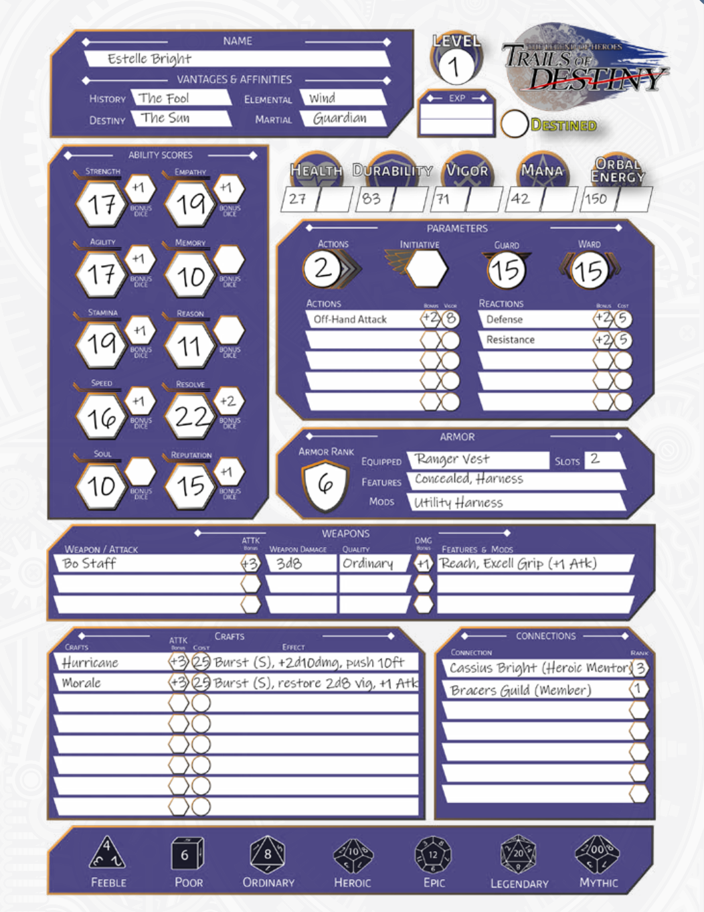
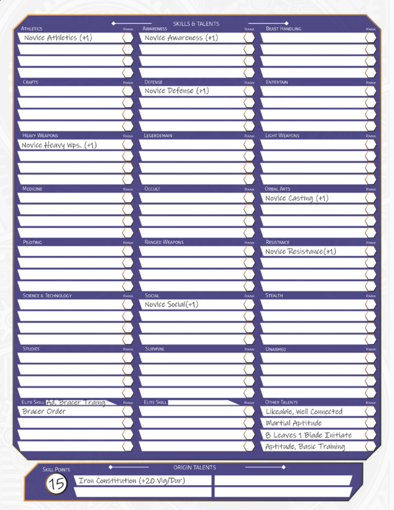
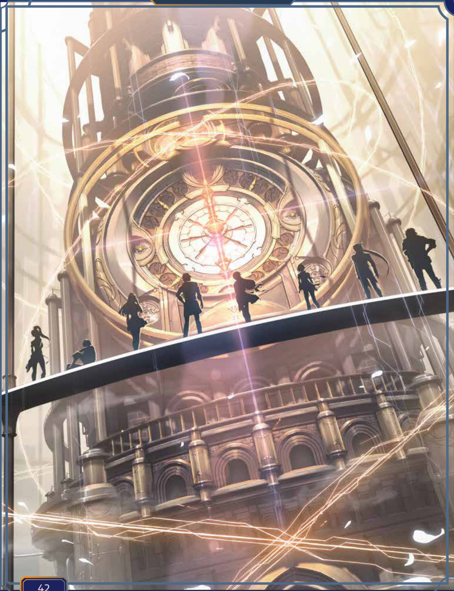

# 第4章 — 角色创建

在《命运之轨迹》中，你将塑造一名由属性值、技能和天赋构筑的角色。

在你开始投掷属性值或选择技能之前，请先思考你想打造的角色类型。无论你的天赋如何，角色的性格才是让他们脱颖而出的关键。钷系统凭借其强大的技能体系，允许你对角色的方方面面进行深度定制，因此，你的角色究竟是谁，才至关重要。

## 理解角色

所有角色都由相同的基本模块构成。这些数值与数据将帮助你裁定行动，并理解你角色的能力。
命途。你过往的碎片，以及你命运的印记，你的优势将帮助你定义一切，从你的导力器到你的起始天赋与人脉。
适性。这描述了你与生俱来的魔法资质。你的适性会影响从导力器配置到魔法与战技效果的方方面面。
人脉。在塞姆利亚大陆，胜负的一半往往不在于你掌握什么知识，而在于你认识什么人。你的人脉会影响你的技能、成长，甚至可能为你开启获取特殊能力的途径。

Temperament。你的Temperament是对你性格与行为的描述。你是更偏理性，还是更偏感性？
属性值。你的背景将决定你为九项属性各投掷什么骰子。声望虽然相似，但它并非衡量你自身能力的固有尺度，其处理方式不同。
声望。你的行动与人际关系会带来相应的后果，以你的声望值来表示。你将利用声望从联络人和人脉处获得好处，或者在他者试图辨认或调查你时发挥作用。你的声望会随着你的等级、活动以及你完成的事迹而增长。
格挡。格挡是敌人在战斗中命中你所必须超过的VS，你的基础格挡为15。你的属性或天赋可能为你提供格挡加值。
守护。这是当你用法术或非物理性的能力瞄准一个生物时，你所必须超过的VS。你的基础守护始于15，你的其他属性也许会为你提供加值。
Armor Rank。若你穿着护甲，你便拥有一个Armor Rank。当你因攻击而承受伤害时，你每次攻击可忽略等同于你Armor Rank数值的伤害，而你减免的这部分伤害会转而由你的护甲耐久所承受。
耐久。这是你在开始承受致命伤害之前，所能承受的表层伤害总量。你受到的伤害会首先扣除耐久，然后才是生命值。
生命值。一旦你的耐久耗尽，在你死亡之前，你还能承受此数值的伤害。生命值恢复缓慢。
耐力。由你的种族与职业决定，你将临时消耗耐力来使用物理战斗能力，例如闪避攻击或使用技艺。
魔力。由你的种族与职业决定，魔力在你启用魔法或超自然能力时会被临时消耗，且恢复缓慢。
导力能量。你导力器中的最大能量，取决于你导力器的设计与品质、你的导力器矩阵以及天赋。你消耗导力能量来施放导力魔法，在大多数情况下，你必须为导力器充能才能恢复导力能量。
反应。当你受到攻击或效果影响时，例如魔法或毒素，你有权进行一次反应。多数反应是用于对抗攻击的防御或抵抗技能检定。
行动。这是你在自己回合里可进行的行动次数。你起始拥有2次行动，并可通过天赋与能力获得更多行动次数。
体型。这是你大体上的体型类别，可能影响你的格挡、移动速度及其他数值。
移动。在战斗中，你可以用一个行动移动等于你速度值的总英尺数。在野外，你每分钟可以移动25英尺乘以你的速度值。冲刺能让你在战斗内外都移动得更快。
技能。技能是针对某一知识领域的行动检定。你起始拥有所有核心技能。你可以通过将技能点投入某一专精领域来获得加值骰，例如轻武器下的剑术或医药下的治疗。
作为1级角色，你只能购买等阶1的天赋。你不能保留或存储任何技能点留待后日使用。你的初始技能点必须在游戏开始前全部分配给技能与天赋。
天赋。你大多数的超凡能力都将通过天赋获得。

以天赋的形式出现。这些天赋可以是单次加值或特殊能力。你可以从起始职业获得天赋，或用技能点从技能树或通用天赋中购买。

## 从想象到行动

角色创建可细分为几个独立步骤。投掷属性值，选择优势与适性，花费技能点，创建人脉，构筑战技，计算最终资源，最后填写杂项信息，例如你的装备与导力器。
但你首先应该与GM坐下来讨论即将开始的游戏。
随着你通过获得经验值来提升，你将升级并完成事迹，从而获得额外技能点来投入技能树或购买天赋。
虽然角色创建是一个简单直接的过程，但由于可选数量众多，可能会花费不少时间。除了选择优势与适性，你还可以通过技能和天赋来定制角色的能力，这是一个耗时但收获颇丰的过程。

### 与GM讨论

在投掷任何骰子或决定任何优势与适性之前，与GM进行一次“零次会议”至关重要。《命运之轨迹》是一款拥有数千种角色选项的庞大游戏，但并非所有选项都能在一个团队中协同作用。首先，讨论游戏的基调，是更侧重于史诗般的政治阴谋，还是更关注个人故事。明确关键主题，如忠诚、友谊或力量的本质。接下来，谈谈你的角色可能拥有的所属组织，无论是游击士、噬身之蛇还是托尔兹士官学院，确保你知晓哪些所属是允许的，或者是否必需特定的所属。最后，GM应当为桌上行为和参与度设定期望，确保一个合作、互相尊重的环境。这将为一个团结且愉快的团队奠定基础。

### 属性值

角色创建的第一步是生成你的属性值。在普罗米修斯系统中，共有九项属性值：力量（STR）、敏捷（AGI）、体魄（STA）、速度（SPD）、灵魂（SOL）、共感（EMP）、记忆（MEM）、理性（RSN）与意志（RSL）。声望类似于属性值，但你不会像生成其他数值那样生成声望。
**投掷属性值**
生成属性值的第一种方法是为每一项初始属性掷 3d8，并按顺序放置。这会产生较高的变异性，但可能不适合所有游戏。
当你投掷属性值时，如果其中一个或多个骰子掷出最大值，你有权再多掷一个同类型的骰子并加上去。这被称为属性暴击。
例如，若你为力量值掷 3d8，结果分别为 8、4、3，你就会额外掷一个 1d8，并将其加在总和上。同样，若你掷出 8、8、2，你仍然只多掷一个 1d8 作为你的暴击属性值。
属性值达到 15 或更高，将为你提供加值骰，用于与该属性值相关的行动检定和技能判定。许多因素，如资源，也直接源自你的属性值。
**购点属性值**
若你的GM采用此规则，所有属性值起始为 8，你必须为每项属性值投入至少 1 点，以提升一项或全部属性值至更高数值。
使用此方法，你起始拥有 60 点，可在各属性值间分配。你可以用此方法将属性值提升至最高 25。
**属性值阵列**
另一种GM可能采用的方法是属性值阵列。使用此方法，你起始获得一组固定的属性值阵列，可按照你的意愿分配：22、19、17、15、15、13、11、10、10。

### 选择命定

接下来，你将从二十二种可用命定中选择两项，一项代表你的**历史**，一项代表你的**命运**。每一项命定都是你人格的基本组成部分；它既是内在的，也是精神层面的。这些方面是你命运的枢轴，会对你的成长和发展产生诸多影响。最值得注意的是，你的命定可能会提升你的初始属性值，决定你可以获得哪些出身天赋，并提供你导力器矩阵的一个方面。
共有二十二种命定。你不必，事实上也不应该，为你的历史和命运选择相同的命定。你对历史命定的选择将塑造你的过去，帮助你理解为何你的角色会踏上冒险之途。你对命运命定的选择则展现你的潜能、你可能成为怎样的人，以及你所擅长的领域。这两项命定共同构成了你角色的基石。
如果你使用随机属性值生成方法，你的两项命定都会将你的一项属性值提升至15。如果你使用固定购点法，这些则成为你必须满足才能选择该命定的前提要求。你的命运命定将赋予你人脉关系或解锁一个精英技能树，而你的历史命定则会让你获得四个出身天赋，这些强大的起始天赋也能解锁精英技能树。

**命定**
**愚者。** 此命定象征充满潜能与冒险成长的命运，或是鲁莽抉择、天真无知、未能从错误中吸取教训的历史。
**魔术师。** 此命定象征精通科技与魔法的命运，或是被操纵、在违背伦理的实验中沦为受害者、滥用力量的历史。
**女祭司。** 此命定象征智慧与神圣知识的命运，或是孤立、恐惧与深藏危险秘密过久的历史。
**皇后。** 此命定象征培育滋养、繁荣兴旺与领导统御的命运，或是过度保护、依赖与忽视的历史。
**皇帝。** 此命定象征领导统御、组织结构与权威权力的命运，或是遭受专制、压迫与挣脱束缚的历史。
**教皇。** 此命定象征精神指引与维护传统的命运，或是固守教条、思想僵化与抑制创新的历史。
**恋人。** 此命定象征建立重要同盟与深层关系的命运，或是羁绊破碎、冲突不断与犹豫不决的历史。
**战车。** 此命定象征决心坚定、夺取胜利与掌控局面的命运，或是行事鲁莽、过度好斗与易与他人的冲突历史。
**力量。** 此命定象征内在坚韧与勇敢领导的命运，或是缺少同情、残暴统治与滥用暴力的历史。
**隐者。** 此命定象征深度内省与智慧洞察的命运，或是孤独寂寞、脱离社会与自我封闭的历史。

正义。此象征代表公平、真理和伦理领导的命运，或失衡、腐败和不公判决的历史。

倒吊人。此象征代表牺牲、灵性洞察和启蒙的命运，或停滞、无谓牺牲和优柔寡断的历史。

死亡。此象征代表转变与重生的命运，或抗拒改变、腐朽和长期苦难的历史。

节制。此象征代表和谐、平衡与整合的命运，或过度、纷争和人生失衡的历史。

恶魔。此象征代表挣脱束缚与腐败的命运，或诱惑、成瘾和操控的历史。

高塔。此象征代表从毁灭中重建并从失败中学习的命运，或傲慢、灾难和骤然崩溃的历史。

星辰。此象征代表希望、更新与启发的命运，或绝望、迷失方向和错失良机的历史。

月亮。此象征代表解开谜团与驱散恐惧的命运，或混乱、欺骗和情绪动荡的历史。

太阳。此象征代表活力、成功与觉悟的命运，或盲目乐观、无知和未预见挑战的历史。

审判。此象征代表转化、觉醒与救赎的命运，或逃避、自我怀疑和未能进化的历史。

世界。此象征代表完成、精通与全球和谐的命运，或未完成、未实现和断裂的历史。

### 选择适性

在《命运之轨迹》中，决定角色的核心要素之一就是适性。它们代表你天生的魔法和武术资质，会影响你的导力魔法与武术战技。你将选择七种元素适性之一和一种武术适性。你的适性将影响你的导力器配置、战技和成长。

**元素适性**
可选元素适性有许多种。你可以自由选择任意下级元素：地、火、风或水作为你的元素适性。若你拥有某种元素的出身天赋，可以将适性改为上级元素之一：时、空或幻。此外，通过相应的出身天赋可获得四种准元素适性：灰（火）、冰（水）、雷（风）和木（地）。最后，在非常特殊的情况下，还可以获得两种超元素适性：分歧（空）与神圣（时）。极少数人还会背负盐之桩适性的诅咒。部分导力器配置会将某些槽位锁定为匹配你元素适性的元素。

Earth。战技提升耐久度、防御力，并能定身或减速敌人。
Fire。战技造成重创并附带持续灼烧效果。
Water。战技增强治疗与再生能力，同时削弱敌方防御。
Wind。提升移动与闪避，战技能够击退或击飞敌人。
Mirage。强化幻象与欺骗，导致困惑或致盲敌人。
Space。战技操控距离，能传送盟友或位移敌人。
Time。改变先攻与行动速度，获得更快的回合和额外行动。
Ash。融合火焰与衰败，造成伤害并降低敌方的治疗效果。
Ice。减速敌人并提升对冻结或寒冷效果的抵抗。
Lightning。战技可造成眩晕、施加持续伤害，或提升你的格挡。
Wood。增强恢复，强化中毒或麻痹效果。
Divergent。火、冰或雷元素的扭曲黑暗镜像。
Divine。战技受到爱德丝加持，强化治疗、防护与神圣干预。
Salt Pale。魔法战技会腐蚀世界并造成石化。

**武术适性**
你的武术适性定义了你天生的战斗风格。每种武术适性会为你的战技增添特定的机制效果。并非所有战技都会调用你的武术适性，有些可能调用你的元素适性，或者两者兼有。

Adaptability：迅速调整策略，运用灵活技巧抓住破绽，并以战术多变性强化盟友。
Aggression：无情的攻击放大伤害；敌人因你毫不松懈的猛攻而动摇，盟友的打击变得更加沉重。
Bravery：以坚定意志恢复耐力，抵御减益，并激励盟友轻松克服恐惧。
Blitz：利用闪电般的速度打出强力一击，同时提升盟友机动性并扰乱敌人的战术。
Conviction：凝聚正义之力眩晕敌人，增强盟友韧性，压垮敌人的精神强韧。
Cruelty：无情地利用敌人弱点，强化异常状态效果，并赋予盟友针对弱点的优势。
Deception：以虚招与诡计误导敌人，掩护盟友，并给敌人的反应施加惩罚。
Dominion：掌控战场，压制敌人的行动，强化盟友的威势，并以控制击垮敌方防御。
Dread：施加恐怖使敌人麻痹；强化盟友来利用恐惧，用心理压迫击溃对手。
Elegance：维持能量高效流转的战斗节奏，节省耐力，并以优雅流畅的攻击扰乱敌人的步调。
Endurance：擅长持久战，随时间积累力量，同时恢复盟友并消耗敌人的耐力。
Equilibrium：平衡进攻与防御；使盟友能果断行动，同时扰乱敌人的专注与势头。
Ferocity：以不懈的攻击压倒敌人，放大盟友伤害，并用毫不退缩的侵略瓦解敌方防御。
Focus：以精确打磨每一次打击，强化集中攻击，支援盟友并打断敌人的集中。
Foresight：预判并反制敌人的行动，为盟友提供战略优势，同时扰乱对手的反应与时机。
Fortune：驾驭运气打出关键一击，用意外的增益扶持盟友，迫敌犯错。
Fury：倾泻无羁怒火粉碎防御，激发盟友的原始力量，用威吓震慑敌人。
Gluttony：吸取敌人的资源来恢复盟友，用偷取的魔力或耐力强化整个团队。
Guardian：保护盟友同时施以强力反击，增强其防御，并惩罚胆敢挑战你守护意志的敌人。
Harmony：与盟友完美协调，强化团队合作，增强攻击并粉碎敌人的协同。
Honor：以毁灭性的专注主导单挑战，延长武器触及距离，用强化的单体决心惩戒敌人。
Judgment：以正义之怒裁决敌人，放大伤害，并赋予盟友对被标记目标执行处决打击的能力。
Mercy：以克制的方式使敌人丧失战力，保护盟友，并通过削弱技巧控制敌人。
Perseverance：在压力下越发强大，寡不敌众时获取力量，鼓舞盟友，并以消耗战削弱敌人。
Power：以力量主宰战场，击退敌人，强化盟友的攻击，并削弱敌方的守护与格挡。
Precision：以极致准确度打击，暴露敌人弱点，放大伤害，并确保盟友的精确攻击有效命中。
Reaving：收割敌人灵魂，击晕对手，并汲取资源来增强盟友，确保战场统治。
Recklessness：在承受异常状态时获得巨大力量，强化盟友打击，并迫使敌人过度伸展而犯错。
Retaliation：受到攻击后变得更强，猛烈反击，增强盟友，并惩罚胆敢攻击你队伍的敌人。
Sacrifice：以自身损耗支撑盟友，加强防御，增强攻击，并迫使敌人将你作为优先目标。
Savagery：施展无休止的狂野攻击，放大盟友的力量，以原始野性威力碾碎敌人。
Serenity：保持镇静，提升精确度，安抚盟友，并用克制而精准的攻击压制敌人行动。
Speed：以快速的行动抢先出手，提高盟友机动性，用不停歇的高速猛攻耗尽敌人。
Tenacity：从逆境中汲取力量，强化攻击，加固盟友对抗状态效果，并打击以你为目标的敌人的士气。
Tyranny：以压倒性的力量粉碎敌人，散播恐惧，压制敌方行动，并让盟友得以利用不安。
Unity：驾驭团队协作，创造协同效应，强化盟友，放大攻击，并迫使敌人犯下可利用的错误。
Valor：以勇敢激励盟友，恢复其耐力，削弱敌方士气，同时坦然面对强敌。
Zeal：以热忱点燃每一次攻击，赋予盟友力量，惩罚敌人，并以炽热能量压倒对手。

### 购买技能与天赋

你初始拥有15点技能点。
除了所有角色都具备的核心技能外，
你可以花费技能点从你可用的出身天赋、精英
技能树、核心技能树以及通用天赋中购买技能
与天赋。出身天赋是角色创建时由你的命定要素赋予的强大天赋，精英技能树通过你的命定要素与所属组织解锁，
而核心技能树包括战斗技能、学术
技能与实践技能。所有角色都可以通过技能点来升级
他们的技能与天赋。
作为一名1级角色，你只能购买
等阶1的天赋。你不能保留任何
技能点留待以后使用；你的初始技能点
必须在开始游戏前全部用于购买技能与天赋。

### 人脉

你的初始声望分数为10。
你对命定优势、出身天赋和通用
天赋的选择将决定你的初始联络人、人脉
和所属组织——如果有的话。你的人脉是
信息、工作和资源的重要来源，
并能让你获得战技、精英技能树和
特殊装备的使用权。
你可以在角色创建时通过命定优势和
天赋来提升声望，
但在1级之后，获得声望的唯一途径
是通过辛勤工作和升级；
在角色创建后，没有任何天赋能提升你的声望。

### 战技

在1级时，你将根据你的天赋和
人脉，有机会选择一些
基础战技。随着你提升武器技能和
精英技能树，你将有机会学习
额外的战技。你不会自动学会战技，
你需要拥有战斗训练天赋、
所属组织加成或其他知识来源
才能学习这些强大的战斗能力。
基础战技是不完整的。一旦你学会一个战技，
你将应用你的武术适性或
元素适性的效果，并选择一个修正项，这将
把战技塑造成你独有的战斗能力。

### 计算资源

资源指你用于采取行动
或应对结果的衍生值：生命值、耐久、
耐力、魔力和导力能量。你的初始天赋和
技能都将影响你的属性值和资源。
许多技能树和天赋也有通过技能点来提升
属性值、生命值、耐久、耐力、魔力或
行动次数的选项。
在你确定了最终属性值后，计算你的
初始资源。
耐久：体魄 + 意志
生命值：体魄 + 10
耐力：体魄 + 20
魔力：意志 + 20
导力能量：灵魂 x 10 + 50

### 装备

每个角色初始都拥有最低限度的
装备和米拉，这些都是冒险者的重要物品。
你初始拥有的所属组织和人脉可能
也会在1级时为你提供装备（或至少提供
购买装备的渠道）。你可能
还从你的职业、技能和天赋组合中获得了非凡的能力。请务必记录这些，
因为它们肯定会派上用场。

### 导力器

最后，你的优势与适性将分别提供你最终导力器配置的一个元素。由你决定收集自己的导力器线路、线路长度、线路元素和锁定插槽，并绘制你的导力器图。

### 出身故事

在创建角色时，他们的能力和特质应该不仅仅是提供机械优势，更应该讲述一个故事。你角色的出身是他们身份的基础，是了解他们经历的生活和塑造他们的经历的一扇窗户。想想是什么时刻定义了它们：是信任盟友的背叛、古代力量的发现，还是为了摆脱卑微出身而奋斗？这些事件不仅构成了你角色的情感核心；还影响着他们如何应对挑战、与他人互动，以及在游戏世界中成长。

从创作引人入胜的叙事开始。你的角色是谁？他们来自哪里？例如，一个出身于自己王国崩溃的角色可能会选择历史优势，如“塔”或“审判”。这些能力直接与他们的旅程相关；他们如何克服困难以及现在所依赖的力量。

从这一叙事出发，让他们的命运与出身天赋自然流淌。如果你的角色曾遭遇背叛并学会了谨慎，像“远见”这样的天赋可能与他们的故事产生共鸣。反过来，如果他们拥抱纯粹的力量来开辟道路，“暴君之力”或“奥术储备”可能更契合。

通过将你的机械选择根植于角色的背景故事，你不仅仅是在构建一组分数和数字，而是在创造一个具有深度、目的和在游戏每一刻都有个人利害关系的英雄（或反英雄）。让你的角色故事引导你。

### 艾丝蒂尔：即使是最伟大的英雄，

### 比如本大小姐我，也得从某个地方开始！

### 每次你获得一个等级，你都将获得一个技能点

### 用于天赋，并且你还会增加

### 你的资源！

