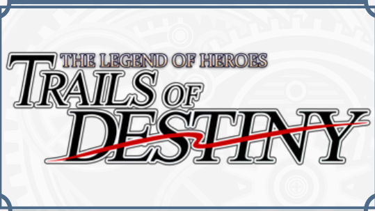

# 规则介绍

你说得对，但《[英雄传说：命运之轨迹](https://www.promethiumbooks.com/legend-of-heroes-trails-of-destiny)》（*The Legend of Heroes: Trails of Destiny*）是一款由 Promethium Books 独立研发、获得日本 Falcom 官方正版授权的全新桌面角色扮演游戏（TRPG）。游戏发生在充满了政治博弈与慢热情感羁绊（大嘘）的塞姆利亚大陆，玩家将在这里扮演打破传统职业与等级上限束缚的自定义英雄。

## 汉化声明

> 能够得到法老控授权，真是意料之外的状况......不，正因为得到授权，才有激动的价值么......
> 
> 上次见到「那个作者」，还是在伊苏的规则里啊。不，应该称作YS Age of Heros吧！这一次，或许有翻译的机会......！

咳咳，轨言轨语到此为止，总之汉化更新中，有兴趣请务必前往[出版商处](https://www.promethiumbooks.com/legend-of-heroes-trails-of-destiny)支持正版。

本译本仅供Trails of Destiny及TRPG爱好者交流使用，禁止用于任何商业用途，版权归Promethium Books与Falcom所有。

## 版本记录

* 2026/6/2: 项目站上线，引言、快速规则、第一至三章完成（未校对）
* 
* 

## 原制作人员

Lead Designer: Ashram Kain

Original Promethium System Design: Ashram Kain

Project Manager: Brandon Miller

Designers: Phoebe Harris, Brandon Miller

Editors: Derek Garcia, Lee Hadan

Cover Art: masky

Interior Artists: masky, Kim Soyeon, locominima

Additional interior artwork courtesy of Nihon Falcom Corporation.
